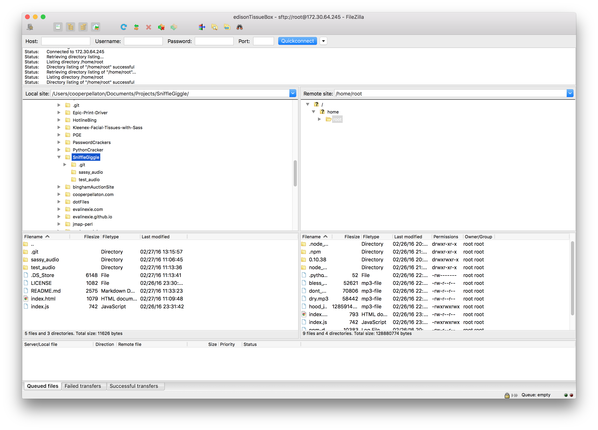

#SniffleGiggle


:poop::poop::poop::poop::poop:

##What is this?

The idea is largely based on this [video](https://www.youtube.com/watch?v=fveM7aTbyuE).

If you still don't understand: this is a stupid simple hack. Our first hardware hack, this uses an Intel Edison paired with a Piezo vibration sensor to detect state changes. If a significant vibration is felt, an emission occurs thanks to Socket.io which then triggers the client to play audio. 

Optimally, we would've had a speaker directly attached to the Edison board but MLH, nor anyone at HampHack '16 had an audio interface. Thus we built this in a really hacky way, using the Edison to detect the tissue being pulled and then alerting the client to play audio in the browser.

##How do I set this up?
Go through the initial setup process for Edison and then be sure to do this while connected to the Edison via SSH:
```
systemctl disable edison_config.service
systemctl stop edison_config.service
systemctl status edison_config.service
```

When you execute that last command you're looking to see that the status of the server is `failed`. If that is the case then proceed to do the following:

`npm install johnny-five galileo-io express http socket.io`

In your home directory, if you just do `ls` then you should see all of the above node modules installed on the Edison board. If this is the case, use a program like FileZilla to connect to your Edison. Just use the IP of your Edison, the root user and it's password like you would with a normal server.


When you connect it should look like the following:


Place all of the files in our repository into the `home/root` folder. Now, from your SSH screen connection to the Edison, simply run: `node index.js` and then go to the IP of your Edison in the browser. Your terminal should look like this:


When a vibration occurs you should see some more events like this:


If you did everything correctly you should see something like this:


Now proceed to pull some tissues and hear some gloriously s:collision:ssy audio *player*!


##Important note about Piezo Sensor.
In our `index.js` file you will see the follwoing lines:
```
var sensor = new five.Sensor({
        pin: "A1"
```
This means that our Piezo vibration sensor is connected via the Edison expansion board to pinout A1. If the connection point of your sensor is different then ours then modify the location of the 'pin' setting. If you don't do this and your sensor isn't connected to `A1` then the above code will execute but nothing will happen because you never established the location of your sensor from which the data is being pulled!

##Pictures of the Edison.


